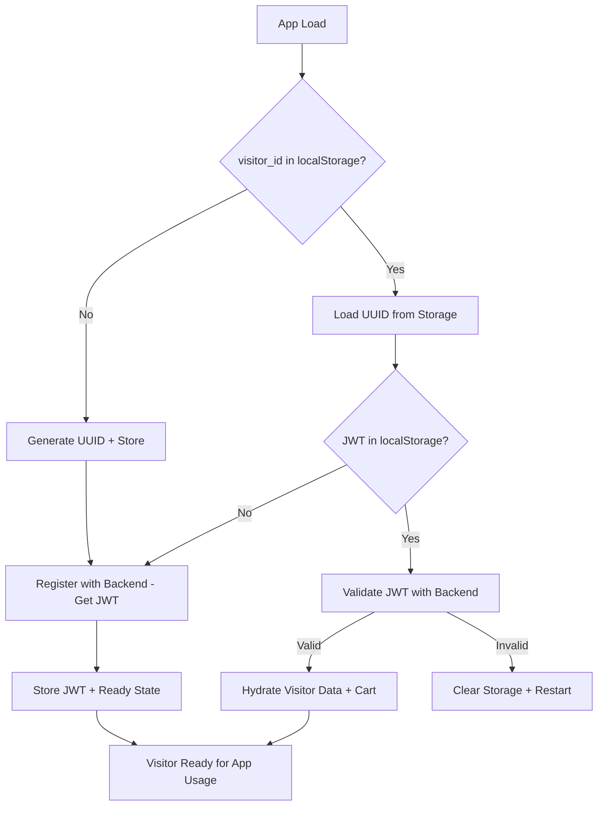

# GoodCup TanStack Query Soft-Auth System - Dev Handoff

## 🎯 Project Vision & Current State

### What We're Building
**Goal**: Replace Zustand entirely with TanStack Query and implement a structured visitor UUID + JWT soft-auth system for seamless user experience with Stripe checkout integration.

**Current Status**: ✅ Modules 1-4 Complete (Visitor Identity System), Ready for Modules 5-8 + A-D (Full Auth + Stripe)

### Why This Architecture
- **No Traditional Sessions**: Using visitor UUID + JWT pattern for lightweight identity
- **Soft-Auth First**: Users can interact before providing contact info
- **Seamless UX**: Cart persists through identity resolution and eventual account creation  
- **Stripe-Ready**: Architecture designed for smooth checkout and subscription management

---

## 🏗️ Technical Architecture

### Core System: Visitor UUID + JWT Soft-Auth



### Database Schema (Supabase)
```sql
-- visitors table
CREATE TABLE visitors (
  id uuid PRIMARY KEY,              -- visitor_id (not auto-generated)
  name text,                       -- optional contact info
  email text,                      -- optional contact info  
  phone text,                      -- optional contact info
  cart jsonb,                      -- persisted cart items
  created_at timestamp DEFAULT now()
);
```

### Key Files & Responsibilities

```
lib/contexts/VisitorContext.tsx     # Core visitor state management
├── Visitor ID generation/persistence
├── JWT authentication flow  
├── Cart hydration from database
├── Identity merge/update functions
└── Auto-sync cart changes to DB

pages/api/visitor/
├── init.ts                        # Register new visitor, get JWT
├── validate.ts                    # Validate returning visitor JWT
├── identify.ts                    # Merge contact info, resolve identity
└── updateCart.ts                  # Sync cart changes to database

store/cartStore.ts                 # TanStack Store for cart state
├── Replaces Zustand entirely
├── localStorage persistence (Zustand format compat)
└── Actions: add/remove/update/clear

components/ContactInfoPopup.tsx    # Contact collection UI
└── Triggers when cart opened + no contact info stored
```

---

## ✅ Completed Modules (1-4.7a)

### Module 1: Visitor ID Handling ✅
**What it does**: Generates/persists visitor UUID in localStorage
```typescript
// Console logs to verify:
// 🆕 No visitor_id found in storage — generated new one: <uuid>
// ✅ Found existing visitor_id in localStorage: <uuid>
```

### Module 2: Visitor Registration & JWT ✅  
**What it does**: Sends visitor_id to backend, gets JWT, creates DB record
```typescript
// Console logs to verify:
// 📡 Sending visitor_id to backend for registration: <id>
// ✅ Visitor registered — JWT received
// 💾 Stored visitor_jwt in localStorage
```

### Module 3: Returning Visitor Validation ✅
**What it does**: Validates JWT, hydrates visitor data + cart from database
```typescript
// Console logs to verify:
// 🔁 Found visitor_id + JWT in localStorage — verifying with backend
// ✅ Valid JWT — visitor authed  
// 🛒 Hydrating cart store with X items from database
// ⚠️ Invalid JWT — clearing localStorage, restarting auth (fallback)
```

### Module 4: Contact Info Merge ✅
**What it does**: Merges contact info, resolves visitor identity, handles cart merging
```typescript
// Console logs to verify:
// 🛒 User triggered contact info collection
// 🔄 Flushing cart updates before identity merge...
// 🔁 Merge result: updated visitor_id <id> and JWT (if merged)
// 📝 Enriched visitor_id <id> with contact info (if no merge)
// 🛒 Hydrating cart store with X items from database
// See module-plans.txt in root folder for full definitions of modules numbered 4x
```

## 🎯 Roadmap: Modules 4.7b-8 + A-D (Next Dev Team)

## Modules 4.7b - Module D are defined in module-plans.txt in the root directory

## 🛡️ Critical Guardrails

### 1. **Don't Break Visitor Flow**
The visitor soft-auth system (Modules 1-4) is the foundation. Any new auth must layer on top:
- ✅ Visitors can still use app without accounts
- ✅ Cart persists through visitor → user conversion
- ✅ Contact info collection still triggers at cart interaction
- ✅ Identity merging still works for duplicate emails

### 2. **Console Logging Pattern**
Maintain consistent emoji-prefixed logging for debugging:
```typescript
console.log('🆕 New visitor generated');
console.log('✅ Operation successful');  
console.log('⚠️ Warning/fallback triggered');
console.log('📡 API call initiated');
console.log('🛒 Cart operation');
console.log('🔁 State update/transition');
console.log('💾 Storage operation');
```

### 3. **Cart Persistence Timing**
Critical timing pattern established in Module 4:
```typescript
// ALWAYS flush cart before identity operations
await syncCartToDatabase(items, jwt);
// THEN perform merge/auth operations
```

### 4. **Error Handling Philosophy**  
- Graceful degradation (app works offline)
- Clear localStorage and restart on auth failures
- Never lose cart data during auth transitions
- Log errors but don't block user experience

### 5. **Type Safety Requirements**
Full TypeScript throughout:
- Interface definitions for all API responses
- Proper typing for cart items, visitor data
- No `any` types except where explicitly needed for flexibility

---

## 🧪 Testing & Verification

### Module Testing Pattern
Each module should be independently verifiable:

1. **Check Console Logs**: Each module has specific log patterns
2. **Test User Flows**: 
   - New visitor experience
   - Returning visitor experience  
   - Contact info submission
   - Cart persistence through auth changes
3. **Test Edge Cases**:
   - Invalid JWT handling
   - Network failures
   - localStorage corruption
   - Duplicate email scenarios

### Critical Test Scenarios
```bash
# Test 1: New visitor flow
1. Clear localStorage 
2. Refresh app
3. Verify new visitor_id generated
4. Verify JWT received from backend
5. Add items to cart
6. Verify cart syncs to database

# Test 2: Returning visitor flow  
1. Return to app with valid visitor_id + JWT
2. Verify JWT validation
3. Verify cart hydrated from database
4. Verify visitor data loaded

# Test 3: Contact info merge
1. Add items to cart as visitor
2. Trigger contact popup (hover cart)
3. Submit email that matches existing visitor
4. Verify identity merge and cart consolidation
5. Verify new JWT and visitor_id received

# Test 4: Invalid JWT handling
1. Manually corrupt JWT in localStorage
2. Refresh app
3. Verify localStorage cleared and new visitor created
4. Verify app continues working
```

---

## 🚀 Environment Setup

### Required Environment Variables
```bash
# Supabase
SUPABASE_URL=your_supabase_url
SUPABASE_SERVICE_ROLE_KEY=your_service_role_key  
SUPABASE_JWT_SECRET=your_jwt_secret

# Stripe (existing)
STRIPE_SECRET_KEY=your_stripe_secret
STRIPE_WEBHOOK_SECRET=your_webhook_secret
NEXT_PUBLIC_STRIPE_PUBLISHABLE_KEY=your_publishable_key
```

### Key Dependencies
```json
{
  "@tanstack/react-query": "latest",
  "@tanstack/react-store": "latest", 
  "@supabase/supabase-js": "latest",
  "jsonwebtoken": "latest",
  "uuid": "latest"
}
```

### Database Setup
- Supabase project with `visitors` table (schema above)
- Row Level Security (RLS) policies configured
- Service role key for backend operations

---

## 📋 Immediate Next Steps

### Phase 1: Audit & Stabilize (1-2 days)
1. **Run full test suite** on existing Modules 1-4
2. **Verify all console logs** appear as expected  
3. **Test edge cases** (invalid JWT, network failures, etc.)
4. **Check for any remaining Zustand usage** to migrate

### Phase 2: TanStack Query Migration (3-5 days)
1. **Audit current query patterns** (products, user data, etc.)
2. **Plan query key structure** for consistency
3. **Migrate to TanStack Query** incrementally
4. **Test performance** and caching behavior

### Phase 3: Full Auth Layer (1-2 weeks)  
1. **Design user account creation flow** that preserves visitor state
2. **Implement Supabase Auth integration** 
3. **Test visitor → user conversion** thoroughly
4. **Build profile management UI**

### Phase 4: Stripe Integration (1 week)
1. **Map visitor_id to Stripe customers**
2. **Update checkout flow** with visitor context
3. **Test subscription flows** for both visitors and users
4. **Implement order history**

---

## 🎯 Success Criteria

### Technical Success
- [ ] Zero Zustand dependencies remaining
- [ ] All queries use TanStack Query patterns
- [ ] Full auth works without breaking visitor experience  
- [ ] Stripe checkout works for visitors and authenticated users
- [ ] Cart persists seamlessly through all auth transitions

### User Experience Success  
- [ ] Visitors can shop immediately without signup
- [ ] Cart never lost during auth transitions
- [ ] Account creation is optional and seamless
- [ ] Checkout works regardless of auth state
- [ ] Performance equal or better than current Zustand implementation

---

## 🆘 Support & Resources

### Code Patterns Reference
- **VisitorContext.tsx**: Template for TanStack Query integration patterns
- **cartStore.ts**: Example TanStack Store implementation  
- **API structure**: RESTful visitor endpoints for reference

### When You Get Stuck
1. **Check console logs** - they tell the story of what's happening
2. **Verify localStorage state** - visitor_id and visitor_jwt should be present
3. **Test API endpoints independently** - use Postman/curl to verify backend
4. **Follow the established patterns** - don't reinvent, extend

### Architecture Decisions Made
- **No Supabase sessions**: Using JWT pattern instead for lighter weight
- **Visitor-first design**: Full auth is optional, not required
- **Cart as source of truth**: Always sync cart before auth operations  
- **Graceful degradation**: App works even when auth fails

---

**This foundation is solid and battle-tested. Build on it, don't rebuild it. The modular approach means you can extend safely without breaking existing functionality.** 

**Good luck! 🚀** 